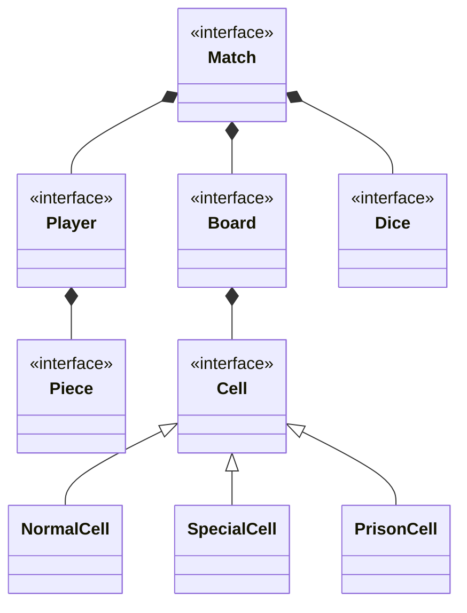
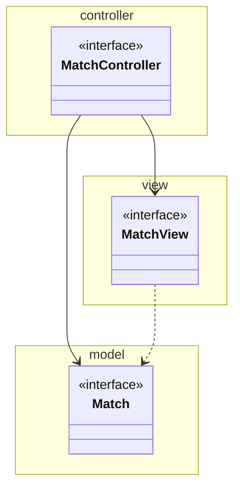

# Capitolo 1

# Analisi

## 1.1 Descrizione e requisiti

Il software si propone di realizzare una versione digitale in chiave moderna del classico gioco da tavolo "Gioco dell'Oca". L'obiettivo è quello di fornire un'esperienza interattiva pensata per un gruppo che va da 2 a 4 partecipanti, mantenendo lo spirito ludico e la natura di competizione basata sulla casualità tipica del gioco originale.
All'avvio, l'applicazione deve permettere all'utente di navigare tramite un menu principale per avviare una nuova partita, modificare le impostazioni, consultare le regole o uscire dal gioco. Prima dell'inizio di una partita, i giocatori devono potersi registrare inserendo il proprio nickname e scegliendo una pedina identificativa.
Il gioco si svolge a turni su un percorso predefinito composto da un numero finito di caselle. L'avanzamento dei giocatori è determinato dal lancio di un dado virtuale a 6 facce. Lungo il percorso sono dislocate caselle speciali che alterano il normale svolgimento della partita, offrendo vantaggi (bonus), svantaggi (malus) o bloccando temporaneamente il giocatore (prigione). La partita si conclude quando un giocatore raggiunge l'esatta posizione dell'ultima casella del percorso.

### Requisiti funzionali

- **Menu Principale:** L'applicazione deve fornire un menu con le opzioni: "Nuova partita", "Impostazioni", "Regole", "Esci".
- **Configurazione Partita:** Il sistema deve permettere la selezione del numero di partecipanti (da 2 a 4). Per ciascun giocatore deve essere possibile inserire un nickname e selezionare una pedina associata.
- **Svolgimento a Turni:** I giocatori si alternano secondo un ordine predefinito. Durante il proprio turno, un giocatore lancia un dado a 6 facce per muovere la propria pedina di un numero corrispondente di posizioni sul tabellone.
- **Tipi di Caselle:** Il percorso è composto da:
  - _Casella Normale:_ non applica alcun effetto aggiuntivo; indica la posizione sul tabellone.
  - _Casella Speciale:_ applica istantaneamente un effetto bonus (es. avanzare ulteriormente) o malus (es. retrocedere) al giocatore che vi capita sopra.
  - _Casella Prigione:_ situata a metà esatta del percorso, blocca il giocatore per un intero turno prima di potersi muovere nuovamente.
- **Condizione di Vittoria:** Il sistema deve decretare la fine della partita e proclamare il vincitore non appena un giocatore raggiunge come posizione finale l'ultima casella del percorso.
- **Salvataggio e Caricamento:** Il sistema deve permettere l'interruzione della partita, salvando lo stato corrente per consentirne la ripresa esatta in sessioni successive.
- **Sistema Audio:** Il gioco deve riprodurre effetti sonori specifici (es. per il lancio del dado e l'attivazione di caselle speciali) e una traccia musicale di sottofondo il cui volume sia configurabile nelle impostazioni.

### Requisiti non funzionali

- **Modularità ed Estensibilità:** Il software deve essere manutenibile ed estendibile, in modo da poter accogliere nuove regole di gioco con un impatto limitato sulle componenti esistenti.
- **Reattività e Sincronizzazione:** L'interfaccia grafica deve riflettere in maniera istantanea e continua i cambiamenti dello stato della partita. Ogni azione (come il lancio del dado o l'applicazione di un effetto) deve mostrare le animazioni e gli aggiornamenti visivi pertinenti senza latenze percepibili.
- **Integrità dei Dati:** Il sistema deve mantenere lo stato interno in maniera sempre coerente, rendendo impossibile l'insorgere di posizioni illegali sul tabellone, turni eseguiti fuori sequenza o dati discordanti tra giocatori.
- **Portabilità:** Il software deve essere in grado di essere eseguito indipendentemente dal sistema operativo sottostante.

## 1.2 Modello del Dominio

Il dominio del problema ruota attorno al concetto di `Partita`, che rappresenta la singola istanza del gioco e aggrega le entità principali necessarie al suo svolgimento. A una partita partecipano molteplici entità `Giocatore`, ognuna identificata da informazioni anagrafiche (nickname) e rappresentata visivamente sul percorso da una Pedina.

L'azione si svolge interamente su un `Tabellone`, il quale è logicamente strutturato come una sequenza ordinata di elementi `Casella`. L'entità casella definisce il percorso e si specializza in tre forme distinte in base al comportamento richiesto: la `CasellaNormale`, la `CasellaSpeciale` (che racchiude la logica per l'assegnazione di un bonus o un malus sul posizionamento), e la `CasellaPrigione`, un vincolo specifico di blocco del turno.
La progressione sul tabellone è unicamente demandata all'entità `Dado`, incaricata di fornire un valore discreto per il calcolo del movimento. Tutte queste entità interagiscono per definire lo stato di avanzamento.

_Figura 1.1: Schema UML dell'analisi del dominio, con rappresentate le entità principali ed i rapporti fra loro._

# Capitolo 2

# Design

## 2.1 Architettura

L'architettura del sistema adotta il pattern Model-View-Controller (MVC), scelto per separare in modo netto la logica di gioco, la gestione dello stato della partita e la sua presentazione all'utente.

Il **Model** coincide con il dominio applicativo descritto nel capitolo precedente: la Partita e le entità ad essa collegate (Tabellone, Giocatore, Casella, Dado) mantengono lo stato della partita ed espongono le operazioni necessarie per modificarlo, senza avere alcuna conoscenza di come tali informazioni verranno successivamente presentate.

Il **Controller**, è il punto di ingresso per le azioni provenienti dall'utente: avvia una nuova partita, gestisce l'alternanza dei turni, inoltra al Model le richieste conseguenti alle azioni del giocatore (ad esempio il lancio del dado) e verifica le condizioni di vittoria al termine di ogni turno.

La **View** osserva il Model per ricevere le notifiche relative ai cambiamenti di stato della partita e le traduce in aggiornamenti dell'interfaccia utente. Si occupa unicamente di mostrare il gioco a schermo (menu, tabellone, animazioni) e di raccogliere le azioni dell'utente, come il click per tirare il dado.

Grazie a questa divisione, sostituire in blocco la View (ad esempio per passare a una diversa libreria grafica) non andrebbe a causare alcuna modifica nel Model e nel Controller. La View si limita a mostrare le informazioni o a osservare lo stato del Model.

In Figura 2.1 è semplificato il diagramma UML architetturale.

_Figura 2.1: Schema UML architetturale MVC del gioco. L'interfaccia `MatchController` coordina il sistema, recependo input dalla `MatchView` e modificando lo stato incapsulato in `Match`._
