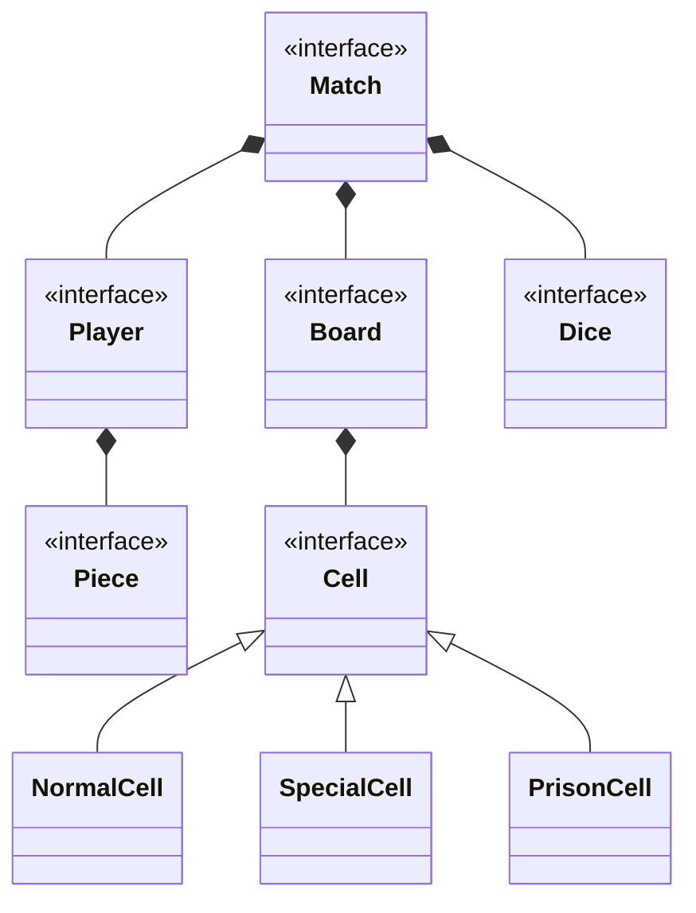
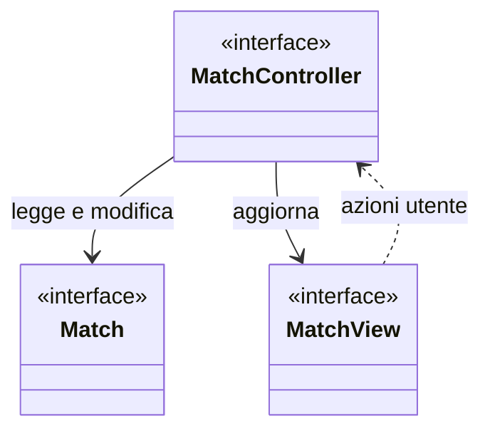
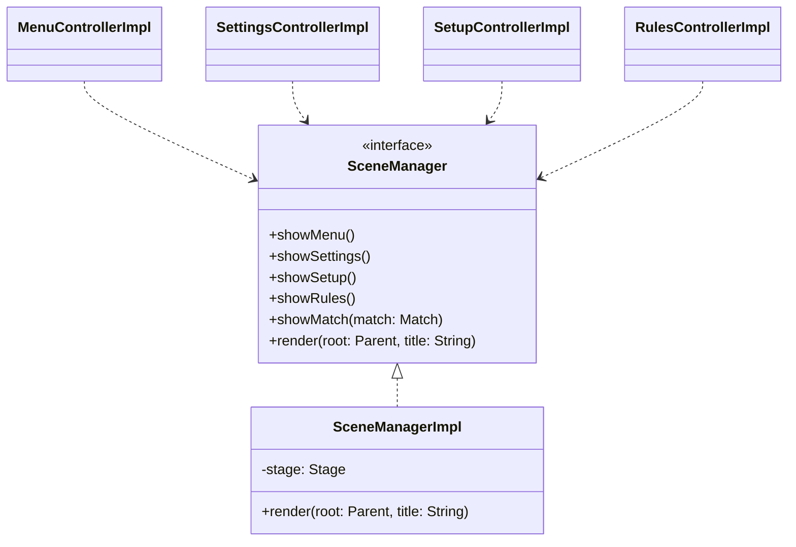
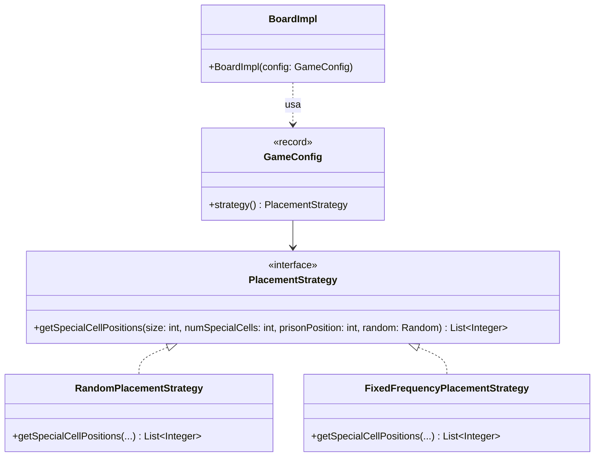
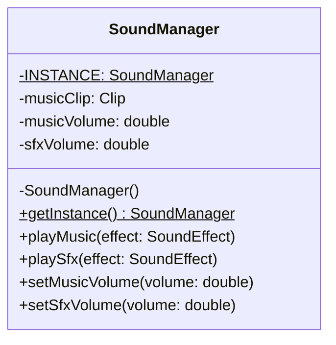
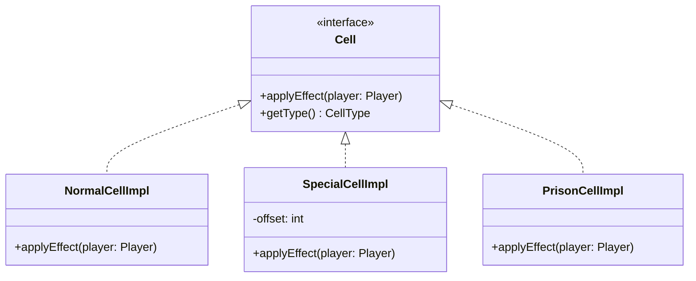

# Capitolo 1

# Analisi

## 1.1 Descrizione e requisiti

Il software si propone di realizzare una versione digitale in chiave moderna del classico gioco da tavolo "Gioco dell'Oca". L'obiettivo è quello di fornire un'esperienza interattiva pensata per un gruppo che va da 2 a 4 partecipanti, mantenendo lo spirito ludico e la natura di competizione basata sulla casualità tipica del gioco originale.
All'avvio, l'applicazione deve permettere all'utente di navigare tramite un menu principale per avviare una nuova partita, modificare le impostazioni, consultare le regole o uscire dal gioco. Prima dell'inizio di una partita, i giocatori devono potersi registrare inserendo il proprio nickname e scegliendo una pedina identificativa.
Il gioco si svolge a turni su un percorso predefinito composto da un numero finito di caselle. L'avanzamento dei giocatori è determinato dal lancio di 1/2 dado/i virtuale a 6 facce. Lungo il percorso sono dislocate caselle speciali che alterano il normale svolgimento della partita, offrendo vantaggi (bonus), svantaggi (malus) o bloccando temporaneamente il giocatore (prigione). La partita si conclude quando un giocatore raggiunge l'esatta posizione dell'ultima casella del percorso.

### Requisiti funzionali

- **Menu Principale:** L'applicazione deve fornire un menu con le opzioni: "Nuova partita", "Impostazioni", "Regole", "Esci".
- **Configurazione Partita:** Il sistema deve permettere la selezione del numero di partecipanti (da 2 a 4). Per ciascun giocatore deve essere possibile inserire un nickname e selezionare una pedina associata.
- **Svolgimento a Turni:** I giocatori si alternano secondo un ordine predefinito. Durante il proprio turno, un giocatore lancia i dadi a 6 facce per muovere la propria pedina di un numero corrispondente di posizioni sul tabellone.
- **Tipi di Caselle:** Il percorso è composto da:
  - _Casella Normale:_ non applica alcun effetto aggiuntivo; indica la posizione sul tabellone.
  - _Casella Speciale:_ applica istantaneamente un effetto bonus (es. avanzare ulteriormente) o malus (es. retrocedere) al giocatore che vi capita sopra.
  - _Casella Prigione:_ situata a metà esatta del percorso, blocca il giocatore per un intero turno prima di potersi muovere nuovamente.
- **Condizione di Vittoria:** Il sistema deve decretare la fine della partita e proclamare il vincitore non appena un giocatore raggiunge esattamente l'ultima casella del percorso. Qualora il risultato del dado porti il giocatore oltre l'ultima casella, la pedina "rimbalza" indietro del numero di posizioni eccedenti, senza vincere la partita.
- **Sistema Audio (opzionale):** Il gioco deve riprodurre effetti sonori specifici (es. per il lancio del dado e l'attivazione di caselle speciali) e una traccia musicale di sottofondo il cui volume sia configurabile nelle impostazioni.

### Requisiti non funzionali

- **Modularità ed Estensibilità:** Il software deve essere manutenibile ed estendibile, in modo da poter accogliere nuove regole di gioco con un impatto limitato sulle componenti esistenti.
- **Reattività e Sincronizzazione:** L'interfaccia grafica deve riflettere in maniera istantanea e continua i cambiamenti dello stato della partita. Ogni azione (come il lancio del dado o l'applicazione di un effetto) deve mostrare le animazioni e gli aggiornamenti visivi pertinenti senza latenze percepibili.
- **Integrità dei Dati:** Il sistema deve mantenere lo stato interno in maniera sempre coerente, rendendo impossibile l'insorgere di posizioni illegali sul tabellone, turni eseguiti fuori sequenza o dati discordanti tra giocatori.
- **Portabilità:** Il software deve essere in grado di essere eseguito indipendentemente dal sistema operativo sottostante.

## 1.2 Modello del Dominio

Il dominio del problema ruota attorno al concetto di `Partita`, che rappresenta la singola istanza del gioco e aggrega le entità principali necessarie al suo svolgimento. A una partita partecipano molteplici entità `Giocatore`, ognuna identificata da informazioni anagrafiche (nickname) e rappresentata visivamente sul percorso da una Pedina.

La partita si svolge interamente su un `Tabellone`, il quale è logicamente strutturato come una sequenza ordinata di elementi `Casella`. L'entità casella definisce il percorso e si specializza in tre forme distinte in base al comportamento richiesto: la `CasellaNormale`, la `CasellaSpeciale` (che racchiude la logica per l'assegnazione di un bonus o un malus sul posizionamento), e la `CasellaPrigione`, un vincolo specifico di blocco del turno.
La progressione sul tabellone è unicamente demandata all'entità `Dado`, incaricata di fornire un valore discreto per il calcolo del movimento. Tutte queste entità interagiscono per definire lo stato di avanzamento.

```mermaid
classDiagram
    direction TB
    class Match {
        <<interface>>
    }
    class Player {
        <<interface>>
    }
    class Board {
        <<interface>>
    }
    class Dice {
        <<interface>>
    }
    class Piece {
        <<interface>>
    }
    class Cell {
        <<interface>>
    }
    class NormalCell
    class SpecialCell
    class PrisonCell

    Match *-- Player
    Match *-- Board
    Match *-- Dice
    Board *-- Cell
    Player *-- Piece

    Cell <|-- NormalCell
    Cell <|-- SpecialCell
    Cell <|-- PrisonCell
```

_Figura 1.1: Schema UML dell'analisi del dominio, con rappresentate le entità principali ed i rapporti fra loro._

# Capitolo 2

# Design

## 2.1 Architettura

L'architettura del sistema adotta il pattern Model-View-Controller (MVC), scelto per separare in modo netto la logica di gioco, la gestione dello stato della partita e la sua presentazione all'utente.

Il **Model** coincide con il dominio applicativo descritto nel capitolo precedente: la Partita e le entità ad essa collegate (Tabellone, Giocatore, Casella, Dado) mantengono lo stato della partita ed espongono le operazioni necessarie per modificarlo, senza avere alcuna conoscenza di come tali informazioni verranno successivamente presentate.

Il **Controller**, è il punto di ingresso per le azioni provenienti dall'utente: avvia una nuova partita, gestisce l'alternanza dei turni, inoltra al Model le richieste conseguenti alle azioni del giocatore (ad esempio il lancio del dado) e verifica le condizioni di vittoria al termine di ogni turno.

La **View** si occupa unicamente di mostrare il gioco a schermo (menu, tabellone, animazioni) e di raccogliere le azioni dell'utente, come il click per tirare il dado. Non ha alcun riferimento diretto al Model e non lo osserva: è il Controller che, dopo aver modificato lo stato del Model, invoca esplicitamente i metodi della View (ad esempio `showDiceResult(...)`, `showCurrentTurn(...)`, `updatePlayerPositions(...)`) per aggiornare l'interfaccia. La View inoltra le azioni dell'utente al Controller tramite callback (ad esempio `controller.rollDice()`).

Grazie a questa divisione, sostituire in blocco la View (ad esempio per passare a una libreria grafica diversa) non causerebbe alcuna modifica nel Model. Ogni schermata dell'applicazione è organizzata in una coppia Controller–View dedicata (ad esempio `MatchController`/`MatchView`, `SettingsController`/`SettingsView`, ecc.): ciascun Controller dipende esclusivamente dall'interfaccia della propria View, mai dall'implementazione concreta.

```mermaid
classDiagram
    class Match {
        <<interface>>
    }
    class MatchController {
        <<interface>>
    }
    class MatchView {
        <<interface>>
    }

    MatchController --> Match : legge e modifica
    MatchController --> MatchView : aggiorna
    MatchView ..> MatchController : azioni utente
```

_Figura 2.1: Schema UML architetturale MVC, esemplificato sulla partita. Il `MatchController` legge e modifica lo stato del `Match` (Model), poi aggiorna la `MatchView` invocandone i metodi. La View non ha alcuna dipendenza dal Model: inoltra le azioni dell'utente al Controller. Lo stesso schema si ripete per ogni coppia Controller–View dell'applicazione._

## 2.2 Design dettagliato
### 2.2.1 Nicolae Balaban

### Architettura di navigazione e disaccoppiamento dei Controller (Application Controller)

**Problema.** Nelle fasi iniziali di sviluppo della GUI, ogni vista era gestita dal proprio controller (es. `MenuController`, `SettingsController`). Per poter tornare alle schermate precedenti (ad esempio dalle impostazioni al menu), i controller dovevano istanziare altri controller passandosi reciprocamente riferimenti come argomenti del costruttore. Questo creava un forte accoppiamento e dipendenze circolari (ad esempio `SettingsController` dipendeva da `MenuController` e viceversa). La logica di navigazione e la gestione della finestra principale (`Stage`) risultavano frammentate e distribuite tra le varie classi.

**Soluzione.** È stata creata l'interfaccia `SceneManager` e la sua implementazione concreta `SceneManagerImpl`, che funge da **Application Controller** (una specializzazione del pattern Mediator): è l'unica classe a detenere il riferimento allo `Stage` di JavaFX. Tutti i controller dipendono esclusivamente dall'interfaccia `SceneManager`. Le View costruiscono il proprio albero grafico e invocano `sceneManager.render(root, title)`, che si limita a sostituire la root della scena (senza aprire nuove finestre). Questo ha eliminato totalmente l'accoppiamento: nessun controller conosce l'esistenza degli altri; ad esempio, quando l'utente preme "Impostazioni", il controller del menu chiama semplicemente `sceneManager.showSettings()`.

```mermaid
classDiagram
    class SceneManager {
        <<interface>>
        +showMenu()
        +showSettings()
        +showSetup()
        +showRules()
        +showMatch(match: Match)
        +render(root: Parent, title: String)
    }

    class SceneManagerImpl {
        -stage: Stage
        +render(root: Parent, title: String)
    }

    class MenuControllerImpl
    class SettingsControllerImpl
    class SetupControllerImpl
    class RulesControllerImpl

    SceneManager <|.. SceneManagerImpl
    MenuControllerImpl ..> SceneManager
    SettingsControllerImpl ..> SceneManager
    SetupControllerImpl ..> SceneManager
    RulesControllerImpl ..> SceneManager
```

_Figura 2.2: Il pattern Application Controller applicato alla navigazione. Ogni controller dipende solo dall'interfaccia `SceneManager`, eliminando le dipendenze circolari._

### Generazione e posizionamento delle caselle speciali (Strategy)

**Problema.** Il gioco richiede caselle speciali distribuite lungo il tabellone. L'utente può scegliere tra diverse modalità di distribuzione (casuale o a intervalli regolari), e si desidera poter aggiungere in futuro nuovi algoritmi di posizionamento senza modificare la classe `BoardImpl`, nel rispetto del principio Open/Closed.

**Soluzione.** È stato adottato il pattern **Strategy**. L'interfaccia `PlacementStrategy` definisce il contratto tramite il metodo `getSpecialCellPositions(...)`. Sono state implementate due strategie concrete: `RandomPlacementStrategy` (posizioni casuali) e `FixedFrequencyPlacementStrategy` (distribuzione a intervalli regolari). La strategia scelta viene iniettata nel record `GameConfig`, che a sua volta è passato a `BoardImpl` al momento della costruzione del tabellone. `BoardImpl` è il _Context_ del pattern: invoca `config.strategy().getSpecialCellPositions(...)` senza conoscere quale strategia concreta sia in uso.

```mermaid
classDiagram
    class PlacementStrategy {
        <<interface>>
        +getSpecialCellPositions(size: int, numSpecialCells: int, prisonPosition: int, random: Random) List~Integer~
    }

    class RandomPlacementStrategy {
        +getSpecialCellPositions(...) List~Integer~
    }

    class FixedFrequencyPlacementStrategy {
        +getSpecialCellPositions(...) List~Integer~
    }

    class GameConfig {
        <<record>>
        +strategy() PlacementStrategy
    }

    class BoardImpl {
        +BoardImpl(config: GameConfig)
    }

    PlacementStrategy <|.. RandomPlacementStrategy
    PlacementStrategy <|.. FixedFrequencyPlacementStrategy
    GameConfig --> PlacementStrategy
    BoardImpl ..> GameConfig : usa
```

_Figura 2.3: Il pattern Strategy per il posizionamento delle caselle speciali. `BoardImpl` delega la scelta delle posizioni all'interfaccia `PlacementStrategy`._

### Gestione centralizzata dell'audio (Singleton)

**Problema.** Il sistema necessita di riprodurre effetti sonori (es. movimento pedine, vittoria) e musica di sottofondo da molteplici punti dell'applicazione (animazioni nella View, logica nel Controller). Istanziare una nuova classe per l'audio ad ogni riproduzione provocava desincronizzazioni e latenza. Passare un'istanza del manager audio come parametro a tutti i Controller e a tutte le View avrebbe inutilmente inquinato i costruttori.

**Soluzione.** È stato impiegato il pattern **Singleton** per la classe `SoundManager`. Un campo statico privato `INSTANCE` viene inizializzato al caricamento della classe; il costruttore è privato e il metodo statico `getInstance()` restituisce il riferimento all'unica istanza. Questo garantisce un solo punto di accesso globale al sistema audio e che le risorse vengano caricate ed eseguite nello stesso contesto, minimizzando la latenza e impedendo la frammentazione del volume tra istanze diverse.

```mermaid
classDiagram
    class SoundManager {
        -INSTANCE: SoundManager$
        -musicClip: Clip
        -musicVolume: double
        -sfxVolume: double
        -SoundManager()
        +getInstance() SoundManager$
        +playMusic(effect: SoundEffect)
        +playSfx(effect: SoundEffect)
        +setMusicVolume(volume: double)
        +setSfxVolume(volume: double)
    }
```

_Figura 2.4: La classe `SoundManager` implementa il pattern Singleton con eager initialization._

### Effetti delle caselle intercambiabili (Strategy)

**Problema.** Il tabellone è composto da diverse tipologie di caselle (Normale, Speciale, Prigione), ciascuna con un effetto diverso sul giocatore che vi atterra. Gestire questi effetti tramite costrutti condizionali nel motore di partita (ad esempio uno `switch` sul tipo di casella in `MatchImpl`) avrebbe concentrato troppa logica nel controller e reso il sistema fragile: aggiungere una nuova tipologia di casella avrebbe richiesto di modificare il codice esistente, violando il principio Open/Closed.

**Soluzione.** È stato applicato il pattern **Strategy** all'interfaccia `Cell`, che dichiara il metodo `applyEffect(Player player)`. Ogni tipologia di casella è una strategia concreta che incapsula il proprio comportamento: `NormalCellImpl` non produce alcun effetto, `SpecialCellImpl` sposta il giocatore di un offset (bonus o malus), e `PrisonCellImpl` blocca il giocatore per un turno. Il motore di partita (`MatchImpl`) si limita a invocare `cell.applyEffect(player)` sulla casella corrente, senza dover conoscere il tipo concreto. Per aggiungere una nuova dinamica di gioco (ad esempio una casella che teletrasporta il giocatore) è sufficiente creare una nuova implementazione di `Cell`, senza toccare nessuna classe esistente.

```mermaid
classDiagram
    class Cell {
        <<interface>>
        +applyEffect(player: Player)
        +getType() CellType
    }

    class NormalCellImpl {
        +applyEffect(player: Player)
    }

    class SpecialCellImpl {
        -offset: int
        +applyEffect(player: Player)
    }

    class PrisonCellImpl {
        +applyEffect(player: Player)
    }

    Cell <|.. NormalCellImpl
    Cell <|.. SpecialCellImpl
    Cell <|.. PrisonCellImpl
```

_Figura 2.5: Il pattern Strategy applicato alle caselle. L'interfaccia `Cell` definisce il contratto `applyEffect(Player)` e ogni implementazione incapsula un diverso effetto di gioco._

# Capitolo 3

# Sviluppo

## 3.1 Testing automatizzato

Il testing automatizzato si è concentrato sulle componenti del modello di dominio, utilizzando il framework JUnit 5. In particolare sono stati verificati:

- **`BoardImplTest`:** correttezza della generazione del tabellone (dimensione, presenza della casella prigione nella posizione attesa, distribuzione delle caselle speciali in base alla strategia).
- **`PlayerImplTest`:** inizializzazione dello stato del giocatore, gestione della posizione e dello stato di prigione.
- **`DiceImplTest`:** verifica che i valori generati dal dado rientrino nell'intervallo atteso.
- **`SpecialCellImplTest`:** applicazione corretta dell'offset (bonus e malus), inclusi i controlli sui limiti del tabellone.
- **`PrisonCellImplTest`:** verifica che l'effetto della cella prigione metta correttamente il giocatore in stato `inPrison`.
- **`NormalCellImplTest`:** verifica che la casella normale non alteri la posizione del giocatore.

## 3.2 Note di sviluppo
### 3.2.1 - Nicolae Balaban

### Uso di lambda expressions

Impiegate in maniera pervasiva per la gestione reattiva degli eventi grafici, rendendo il codice significativamente più conciso rispetto all'utilizzo di classi anonime.

[Permalink](https://github.com/Nick-2002b/PSS25-Gioco-Oca/blob/e81943445d44f9befaaf74b02e1793cb20d0ce74/src/main/java/it/unibo/giocooca/view/impl/SettingsViewImpl.java#L97)

### Uso di switch expressions (arrow syntax)

Utilizzate per migliorare la leggibilità e ridurre le possibilità di errori da fall-through, sfruttando la sintassi `->` introdotta in Java 14+.

[Permalink](https://github.com/Nick-2002b/PSS25-Gioco-Oca/blob/e81943445d44f9befaaf74b02e1793cb20d0ce74/src/main/java/it/unibo/giocooca/view/impl/BoardViewImpl.java#L117-L122)

### Uso di Java Records

Il costrutto `record` è stato sfruttato per definire piccole classi portatrici di dati immutabili, eliminando il boilerplate (costruttori, getter, `equals`, `hashCode`). Usato sia nel model (`GameConfig`) sia nella view (`LogicalCoords`, `GridCoords` in `BoardViewImpl`).

[Permalink](https://github.com/Nick-2002b/PSS25-Gioco-Oca/blob/e81943445d44f9befaaf74b02e1793cb20d0ce74/src/main/java/it/unibo/giocooca/view/impl/BoardViewImpl.java#L430-L434)

### Pattern Matching for `instanceof`

Utilizzato per il cast sicuro e conciso, evitando la verbosità del check e cast su due righe separate.

[Permalink](https://github.com/Nick-2002b/PSS25-Gioco-Oca/blob/e81943445d44f9befaaf74b02e1793cb20d0ce74/src/main/java/it/unibo/giocooca/navigation/impl/SceneManagerImpl.java#L84)

### Uso della libreria `javax.sound.sampled`

Parte della JDK ma non trattata a lezione. Utilizzata in `SoundManager` per la riproduzione audio (`Clip`, `AudioSystem`, `FloatControl`) con gestione del volume in decibel.

[Permalink](https://github.com/Nick-2002b/PSS25-Gioco-Oca/blob/e81943445d44f9befaaf74b02e1793cb20d0ce74/src/main/java/it/unibo/giocooca/audio/SoundManager.java#L136-L142)

### Uso della libreria di terze parti JavaFX

Impiegata come framework grafico per tutte le view. In particolare, le classi di animazione (`TranslateTransition`, `SequentialTransition`, `PauseTransition`) sono state utilizzate per il movimento delle pedine sul tabellone.

[Permalink](https://github.com/Nick-2002b/PSS25-Gioco-Oca/blob/e81943445d44f9befaaf74b02e1793cb20d0ce74/src/main/java/it/unibo/giocooca/view/impl/BoardViewImpl.java#L399-L403)

# Capitolo 4

# Commenti finali

## 4.1 Autovalutazione e lavori futuri
### 4.1.1 - Nicolae Balaban

**Ruolo nel gruppo.** Ho rivestito il ruolo di responsabile della parte grafica e della struttura di navigazione dell'applicativo. Nello specifico, mi sono occupato dell'architettura di navigazione tra schermate (`SceneManager`), della realizzazione grafica del tabellone (`BoardViewImpl`), delle view per impostazioni e regole (`SettingsViewImpl`, `RulesViewImpl`), dell'implementazione delle classi del modello (`PlayerImpl`, `BoardImpl`, `DiceImpl`, le specializzazioni di `Cell`), del pattern Strategy per il posizionamento delle caselle speciali, e del sistema audio centralizzato (`SoundManager`).

**Punti di forza.**

- Il tabellone è completamente espandibile: l'interfaccia `Cell` e il metodo `applyEffect(Player)` permettono di aggiungere nuove tipologie di caselle senza alterare il motore di partita.
- Il pattern Strategy consente di aggiungere nuovi algoritmi di distribuzione delle caselle speciali senza toccare `BoardImpl`.
- L'architettura `SceneManager` ha eliminato completamente le dipendenze circolari tra controller, rendendo ogni controller indipendente dagli altri.

**Punti di debolezza.**

- Scrivere tutta la GUI in codice procedurale Java rende alcune classi View inevitabilmente prolisse rispetto a un approccio dichiarativo con markup.
- Migliorare la gestione della riproduzione degli effetti audio sfx perche' attualmente non la ritengo soddisfacente personalmente.

**Lavori futuri.** Si potrebbe estrapolare tutta la parte grafica usando fogli di stile CSS e layout FXML per una miglior separazione tra logica e presentazione. Si potrebbero inoltre aggiungere ulteriori dinamiche di gioco (nuove tipologie di caselle, modalità multigiocatore online) sfruttando l'estensibilità già predisposta dal modello.

## 4.2 Difficoltà incontrate e commenti per i docenti
### 4.2.1 - Nicolae Balaban
La difficoltà principale ha riguardato la realizzazione grafica del tabellone a "serpentone". Il percorso del gioco dell'oca prevede righe dritte separate da caselle d'angolo, con direzione alternata. Si è resa necessaria una netta separazione tra coordinate logiche (dove sta una casella nel percorso) e coordinate della griglia (come `GridPane` la posiziona sullo schermo), implementata nei metodi `toLogicalCoords` e `toGridCoords`. In particolare, `GridPane` conta le righe dall'alto verso il basso, mentre il percorso parte dal basso. 

Far entrare il tabellone nella finestra di gioco (1280×800, non ridimensionabile) ha richiesto diversi tentativi. Inizialmente si è provato a scalare automaticamente il tabellone in base alle dimensioni della finestra, ma questo causava problemi con il posizionamento delle pedine. Si è quindi scelto un approccio più semplice: regolare manualmente le dimensioni delle celle e gli spazi tra di esse fino a ottenere un risultato visivamente corretto nella finestra fissa.

## Credits
- Roll dice sound: https://freesound.org/people/nettimato/sounds/353975/
- Piece board move: https://freesound.org/people/alexarje/sounds/863256/
- Winning sound: https://pixabay.com/sound-effects/film-special-effects-winning-218995/
- Positive cell and Malus cell sfx: https://ci.itch.io/400-sounds-pack
- Background music: https://pixabay.com/music/video-games-roblox-minecraft-fortnite-video-game-music-358426/
- Prison Door(the-sound-of-the-prison-door-opening): https://sounddino.com/en/effects/prison/
- Logo Icon: Generated with Artifical Intelligence
- All Icons: https://www.flaticon.com/
- Goose icons: [https://www.flaticon.com/](https://www.flaticon.com/free-icon/goose_2826245?related_id=2836013&origin=search)
- Background image: Generated with Artifical Intelligence
- Black and White Checkered Pattern: https://www.cleanpng.com/png-taxi-driver-yellow-cab-yandex-taxi-chi-rho-k8mdfo/download-png.html
- Dice icons: https://game-icons.net/tags/dice.html
- Spring sound: https://sounddino.com/en/search/?kind=sound&s=spring
